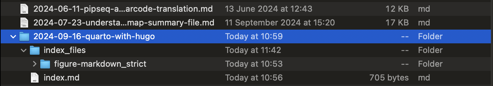
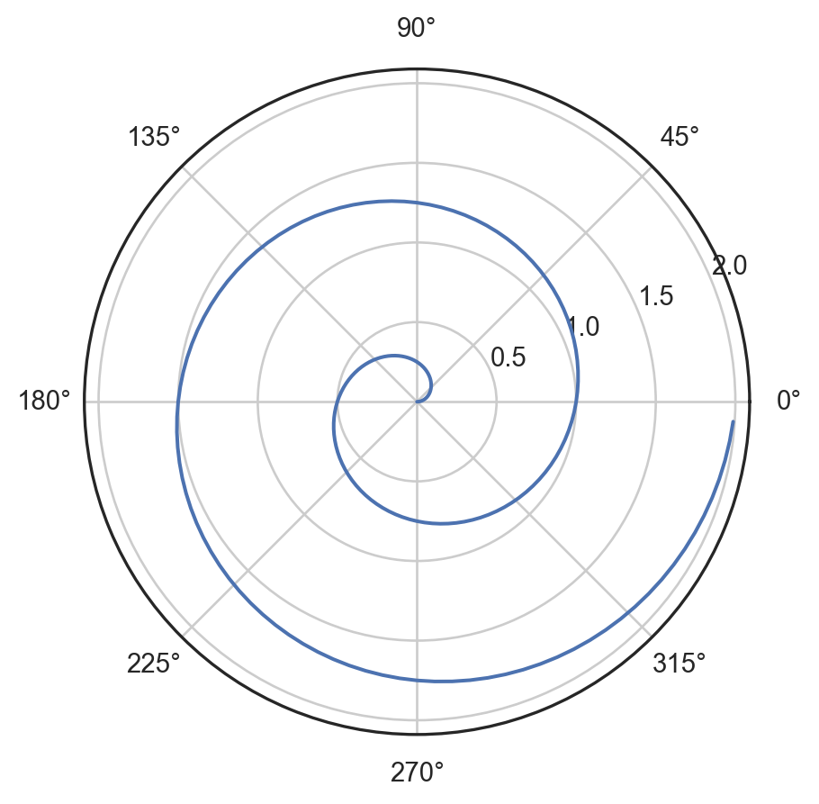

Very often, I need to write in a [Jupyter/IPython Notebook](https://ipython.org/notebook.html)-like style, where output is immediately shown after a block of code. In the past, I just copy pasted the code block, saved the output plot as image files and displayed them using the `` syntax in markdown or the figure shortcode of [Hugo](https://gohugo.io). However, it becomes tedious when there are many blocks of code and plots, obviously. I need a better option.

An initial search gave me [nb2hugo](https://github.com/vlunot/nb2hugo). It seemed to do the job, but the tool is not actively maintained. There were also other issues with front matters and paths as described [in this post](https://skeptric.com/jupyter-hugo-blog/).

Then I came across [Quarto](https://quarto.org), which is just perfect for writing Notebook-style post. It can build webiste on its own, just like **Hugo**. I was tempted to make the switch from Hugo to Quarto. I eventually did not, since I mostly write stuff in plain markdown and I really like the minimalism Hugo theme [Gokarna](https://github.com/526avijitgupta/gokarna). In addition, I'm already used to using Hugo.

It turns out that Quarto has a native support to produce Hugo post. The procedures are described [here](https://quarto.org/docs/output-formats/hugo.html) from their official documentation. In this post, I just documented how I use Quarto to produce this post itself. If I just follow the steps from their officially documentation, it will not work. I still have to manully fix the front matter. On top of that, I have specific ways of doing things, so I eventually did not follow the exact steps from the documentation.

To get started, I need to add the following lines to the hugo site configure file. In my case, it is `config.toml` at the site root directoy:

``` toml
[markup.goldmark.renderer]
  unsafe = true
```

The first line should be at the base level, that is, the same level as `baseURL`. For example, this is the top few lines of my `config.toml`:

``` toml
baseURL = "https://notarocketscientist.xyz"
title = "Not A Rocket Scientist"
theme = "gokarna"
languageCode = "en-gb"
defaultContentLanguage = "en-gb"
enableEmoji = true
enableRobotsTXT = true
pygmentsStyle = "onedark"

[markup.goldmark.renderer]
  unsafe = true
```

After that, I was ready to write this post. In this case, I created a file called `index.qmd` in a place that is completely outside my hugo website directory, such as `Documents/work_in_progress`. In the file `index.qmd`, add the following lines as the front matter:

``` yaml
---
title: "Quarto With Hugo"
format:
  html:                # Not really needed for this post
    code-fold: false   # Not really needed for this post
  hugo-md:
    code-fold: false
editor:                # Not really needed for this post
  render-on-save: true # Not really needed for this post
jupyter: python3
---
```

Note that those four lines with comments are not really needed for this post. When I write, I usually use [VS Code](https://github.com/microsoft/vscode) and I would like to preview the rendered content at the side. Those four lines are needed for the live preview.

Once I put the front matter like that, I can continue to write stuff as usual. For me, I just treat the `qmd` format as the regular markdown with added syntaxes and functionalities for computational code and output rendering. The [quick tutorial](https://quarto.org/docs/get-started/hello/vscode.html) from the Quarto website is a good starting point to grasp the idea.

When I finished writing, I went to the place where the file `index.qmd` was located in Terminal, e.g. `Documents/work_in_progress`, and rendered the file by typing:

``` console
quarto render index.qmd
```

It should finish without any problem. Some new stuff would be produced, including `index.md`, `index.html` and a directory called `index_files` that contains some other directories and files. The structure was like this:


The newly generated file `index.md` was the Hugo-compatible markdown file ... almost ... At this stage, the front matter in the `index.md` was exactly the same as that in `index.qmd`, which cannot be recognised by Hugo. In order for Hugo to build the post from the `index.md` file, I manually changed the front matter in the `index.md` file to the following:

``` yaml
---
title: "Quarto With Hugo"
date: 2024-09-16T09:00:00+08:00
tags: ['hugo', 'quarto', 'python', 'notebook']
draft: false
type: post
---
```

Okay, it was almost ready at that stage. I headed to where I usually write posts, which is `content/posts/`. Normally, I would just create a markdown file under `content/posts/`, like this:


However, I needed to do a slightly different style in this case. Here I used the [Page Bundles](https://gohugo.io/content-management/page-bundles/) feature of Hugo. I created a directory under `content/posts/` called `2024-09-16-quarto-with-hugo`, sitting at the same level with all my other `.md` post files. Then I went to `Documents/work_in_progress`, copy the `index.md` and `index_files/figure-markdown_strict` into `content/posts/2024-09-16-quarto-with-hugo/`, like this:



After that, everything was ready, and I could use the usual `hugo server` command to preview and `hugo` to publish. You can find the raw files `index.qmd` and `index.md` to generate this post from [here](https://github.com/dbrg77/quarto_hugo_demo).

The following content is just used for testing.

For a demonstration of a line plot on a polar axis, see <a href="#fig-polar" class="quarto-xref">Figure 1</a>. This is with the `code-fold: false` setting.

``` python
import numpy as np
import matplotlib.pyplot as plt

r = np.arange(0, 2, 0.01)
theta = 2 * np.pi * r
fig, ax = plt.subplots(
  subplot_kw = {'projection': 'polar'} 
)
ax.plot(theta, r)
ax.set_rticks([0.5, 1, 1.5, 2])
ax.grid(True)
plt.show()
```



Another demonstration of [ridge plot](https://seaborn.pydata.org/examples/kde_ridgeplot.html) from the [seaborn](https://seaborn.pydata.org/index.html) package. This is with the `code-fold: true` setting, and the following codes are directly copied from [the seaborn gallery](https://seaborn.pydata.org/examples/kde_ridgeplot.html). Based on the output, it seems I should have turned off the warnings.

<details class="code-fold">
<summary>Code</summary>

``` python
import numpy as np
import pandas as pd
import seaborn as sns
import matplotlib.pyplot as plt
sns.set_theme(style="white", rc={"axes.facecolor": (0, 0, 0, 0)})

# Create the data
rs = np.random.RandomState(1979)
x = rs.randn(500)
g = np.tile(list("ABCDEFGHIJ"), 50)
df = pd.DataFrame(dict(x=x, g=g))
m = df.g.map(ord)
df["x"] += m

# Initialize the FacetGrid object
pal = sns.cubehelix_palette(10, rot=-.25, light=.7)
g = sns.FacetGrid(df, row="g", hue="g", aspect=15, height=.5, palette=pal)

# Draw the densities in a few steps
g.map(sns.kdeplot, "x",
      bw_adjust=.5, clip_on=False,
      fill=True, alpha=1, linewidth=1.5)
g.map(sns.kdeplot, "x", clip_on=False, color="w", lw=2, bw_adjust=.5)

# passing color=None to refline() uses the hue mapping
g.refline(y=0, linewidth=2, linestyle="-", color=None, clip_on=False)


# Define and use a simple function to label the plot in axes coordinates
def label(x, color, label):
    ax = plt.gca()
    ax.text(0, .2, label, fontweight="bold", color=color,
            ha="left", va="center", transform=ax.transAxes)


g.map(label, "x")

# Set the subplots to overlap
g.figure.subplots_adjust(hspace=-.25)

# Remove axes details that don't play well with overlap
g.set_titles("")
g.set(yticks=[], ylabel="")
g.despine(bottom=True, left=True)
```

</details>

    /Users/xichen/miniconda3/envs/scs/lib/python3.11/site-packages/seaborn/axisgrid.py:123: UserWarning: Tight layout not applied. tight_layout cannot make Axes height small enough to accommodate all Axes decorations.
      self._figure.tight_layout(*args, **kwargs)
    /Users/xichen/miniconda3/envs/scs/lib/python3.11/site-packages/seaborn/axisgrid.py:123: UserWarning: Tight layout not applied. tight_layout cannot make Axes height small enough to accommodate all Axes decorations.
      self._figure.tight_layout(*args, **kwargs)
    /Users/xichen/miniconda3/envs/scs/lib/python3.11/site-packages/seaborn/axisgrid.py:123: UserWarning: Tight layout not applied. tight_layout cannot make Axes height small enough to accommodate all Axes decorations.
      self._figure.tight_layout(*args, **kwargs)
    /Users/xichen/miniconda3/envs/scs/lib/python3.11/site-packages/seaborn/axisgrid.py:123: UserWarning: Tight layout not applied. tight_layout cannot make Axes height small enough to accommodate all Axes decorations.
      self._figure.tight_layout(*args, **kwargs)
    /Users/xichen/miniconda3/envs/scs/lib/python3.11/site-packages/seaborn/axisgrid.py:123: UserWarning: Tight layout not applied. tight_layout cannot make Axes height small enough to accommodate all Axes decorations.
      self._figure.tight_layout(*args, **kwargs)


